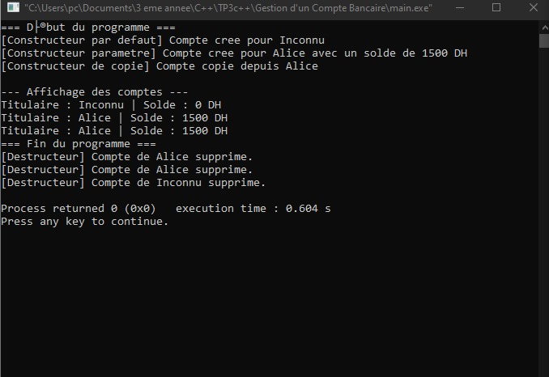
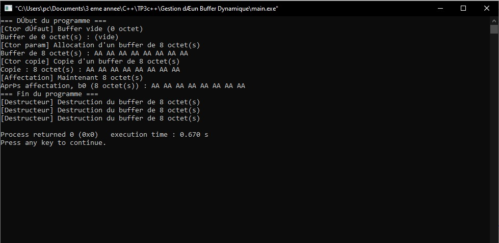

# TP3 – Constructeurs et Destructeurs en C++

## Cours : Programmation Orientée Objet (C++)

---

## Objectif général
Ce TP a pour but de comprendre et d’appliquer les **constructeurs**, le **constructeur de copie**, l’**opérateur d’affectation**, ainsi que le **destructeur** en C++.
L’accent est mis sur :
- la gestion du **cycle de vie des objets** ;
- la **copie d’objets** (superficielle vs profonde) ;
- la **gestion manuelle de la mémoire** ;
- le respect de la **règle des trois (Rule of Three)**.

---

## Exercice 1 — Gestion d’un Compte Bancaire

### Objectif
Mettre en œuvre différents types de constructeurs et un destructeur dans une classe `CompteBancaire`.

### Spécifications techniques

**Attributs privés :**
- `std::string titulaire` — Nom du titulaire du compte  
- `double solde` — Montant du solde du compte

**Méthodes publiques :**
- **Constructeur par défaut** → initialise le titulaire à `"Inconnu"` et le solde à `0.0`
- **Constructeur paramétré** → initialise le titulaire et le solde à partir de paramètres
- **Constructeur de copie** → crée un nouvel objet à partir d’un autre (avec `const &`)
- **Méthode `afficher()`** → affiche les informations du compte
- **Destructeur** → affiche un message lors de la destruction de l’objet

---

## Résultat visuel

  
  
<em>Figure 1 — Résultat Exercice 1</em>

---

## Exercice 2 — Gestion d’un Buffer Dynamique

### Objectif
Apprendre à gérer la mémoire dynamique dans une classe C++, en implémentant un constructeur, un constructeur de copie (copie profonde), et un destructeur sûr.

### Spécifications techniques

**Attributs privés :**
- `size_t size` — Taille du buffer (nombre d’octets)
- `unsigned char* data` — Pointeur vers la zone mémoire allouée

**Constructeurs :**
- **Par défaut :** initialise `data` à `nullptr` et `size` à `0`
- **Paramétré :** prend `size_t n`, alloue `n` octets et les remplit de `0`
- **De copie (deep copy) :** duplique le contenu d’un autre buffer

**Méthodes publiques :**
- `size_t getSize() const` — retourne la taille du buffer
- `void fill(unsigned char value)` — remplit tout le buffer avec une valeur
- `void printHex() const` — affiche le contenu en hexadécimal

**Destructeur :**
- libère la mémoire allouée et affiche un message de libération

---

## Résultat visuel

  
  
<em>Figure 2 — Résultat Exercice 2</em>

---

## Concepts clés abordés
- Constructeurs et destructeurs  
- Constructeur de copie  
- Copie profonde vs copie superficielle  
- Gestion manuelle de la mémoire

## Environnement de développement
- Langage : C++ (standard ≥ C++11)  
- Compilateur : g++ ou clang++  
- IDE recommandé : Code::Blocks, Visual Studio Code, Eclipse CDT
